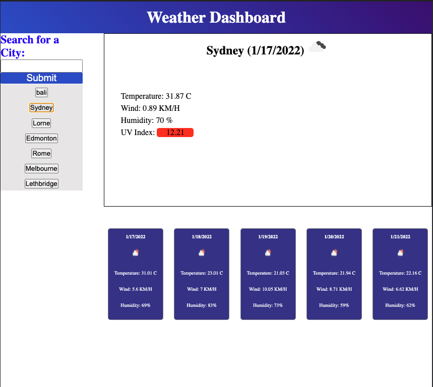

# bootcamp-week6-homework

This repository holds the code for the "Universiuty of Sydney Full Stack FLex Bootcamp" week 6 homework. The page is a weather app that allows a user to search for a city and get the current day weather information (temperature, wind, humidity, uv index), an icon for the weather, and the current date. It also provides users with a 5 day forecast, each day being represnted in an idividual card with the date, temperature, wind, humidity and an icon of the weather.

The first visit to the page presents the user with a black calandar page as seen below:

The UV index rating in the current day window is color coded by uv v alue. If hte uv is 4 or less, it is green, if it is greter than 4 and less than 8, it uis yellow, and anything greater than 8 is red. These colors represent the risk of direct sunlight at a given time.

After searching for a city, it gets stored in localStorage by the city name and added to a clickable list of searches. This allows the user to view any city that they have searched for i nthe past, recalling the data and viewing the forecast. Any search for the same city as one that already exists in local storage is not added to storage (already has a button in the saved searches list), but the data is still retrieved for users to view.

# Testing Instructions:

1. Type a city
2. Press the submit button
3. reopeat for as many cities as you want
4. reload the page
5. Click on any saved city
6. view the forecast for the selected city

The page is hosted using GitHub Pages and is viewable at this URL:
https://evancwoods.github.io/bootcamp-week6-homework/